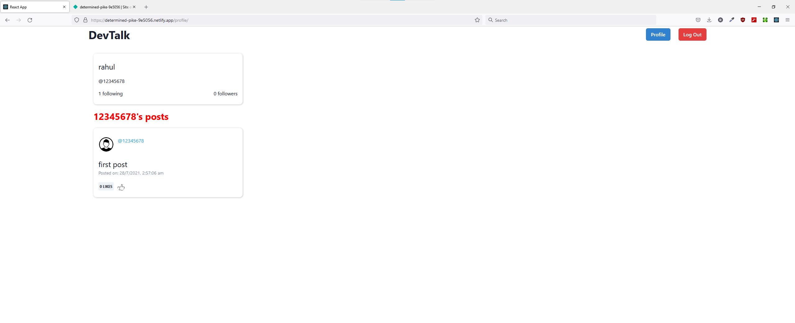

# Devtalks 

# Social Media Website

## Sign Up
---

The signup page is made validation in mind. 
    # The usernames are unique
    # Avatar is optional

## Login
---

The login page is made validation in mind. 
    # Requires Username and Password
    # succesful login will take you to feeds page

## Feeds Page
---

The feeds page contains users posts and post by users followed by the user.
The page also contains suggestions box which will have list of 5 people user can follow

## Add Post
---

The add post component lets the user add a post,

## Profile Page
---

The profile page gives you posts from the selected user.
It also allows you to follow or unfollow a user

### User Profile

### Unfollowed Other User Profile

### Followed Other User Profile

